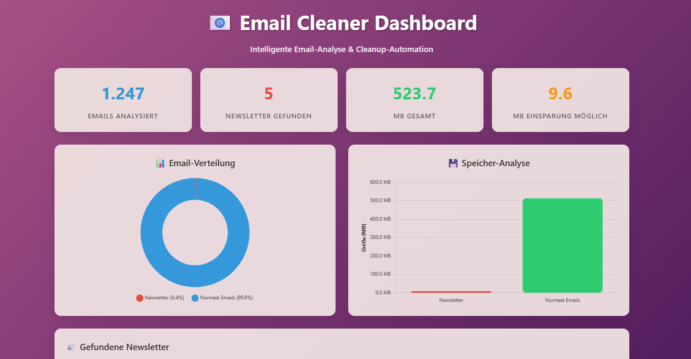

# 📧 Email Cleaner - Smart Gmail Automation

> Intelligent email analysis and cleanup tool with real-time Gmail integration. Automatically detect newsletters, unsubscribe from unwanted emails, and reclaim your inbox.


## ✨ Features

### 🔍 **Smart Analysis**
- **Newsletter Detection**: AI-powered identification using multiple criteria
- **Unsubscribe Link Detection**: Automatic extraction from email headers and content
- **Storage Analysis**: Detailed breakdown of email storage usage
- **Interactive Visualizations**: Charts and graphs for email data insights

### ⚡ **Live Actions**
- **One-Click Unsubscribe**: Automatic newsletter unsubscription
- **Bulk Operations**: Delete or unsubscribe from multiple emails at once
- **Selective Cleanup**: Choose specific emails for targeted actions
- **Real-time Feedback**: Live status updates and progress tracking

### 🛡️ **Safety & Security**
- **Confirmation Dialogs**: All destructive actions require confirmation
- **Gmail API Integration**: Secure OAuth2 authentication
- **Rate Limiting**: Prevents API abuse and ensures stability
- **Error Handling**: Graceful failure recovery and user feedback

## 🚀 Quick Start

### Prerequisites
- Python 3.8+
- Gmail account
- Google Cloud Console project with Gmail API enabled

### Installation

1. **Clone the repository**
   ```bash
   git clone https://github.com/yourusername/email-cleaner.git
   cd email-cleaner
   ```

2. **Backend Setup**
   ```bash
   cd backend
   python -m venv venv
   source venv/bin/activate  # On Windows: venv\Scripts\activate
   pip install -r requirements.txt
   ```

3. **Google API Setup**
   - Create a project in [Google Cloud Console](https://console.cloud.google.com/)
   - Enable Gmail API
   - Create OAuth2 credentials
   - Download `credentials.json` to `backend/` folder

4. **Start the Backend**
   ```bash
   python email_api.py
   ```

5. **Open Frontend**
   ```bash
   cd ../frontend
   open index.html  # Or serve with a local server
   ```

## 🏗️ Architecture

```
Frontend (HTML/CSS/JS)
    ↕️ REST API
Backend (Python Flask)
    ↕️ OAuth2
Gmail API (Google)
```

### Technology Stack
- **Frontend**: Vanilla JavaScript, Chart.js, Modern CSS
- **Backend**: Python Flask, Google API Client
- **Authentication**: OAuth2 with Gmail API
- **Deployment**: Railway (Backend), Vercel (Frontend)

## 📊 API Documentation

### Endpoints

| Method | Endpoint | Description |
|--------|----------|-------------|
| `GET` | `/api/health` | API health check |
| `POST` | `/api/email/{id}/delete` | Delete single email |
| `POST` | `/api/email/{id}/unsubscribe` | Unsubscribe from newsletter |
| `POST` | `/api/bulk-delete` | Delete multiple emails |
| `POST` | `/api/bulk-unsubscribe` | Unsubscribe from multiple newsletters |

### Example Response
```json
{
  "success": true,
  "message": "Successfully unsubscribed from newsletter",
  "url": "https://example.com/unsubscribe"
}
```

## 🔧 Configuration

### Environment Variables
```bash
# Copy example and configure
cp .env.example .env
```

Key variables:
- `GOOGLE_CLIENT_ID`: OAuth2 client ID
- `GOOGLE_CLIENT_SECRET`: OAuth2 client secret
- `FLASK_ENV`: Environment (development/production)

## 📸 Screenshots

### Dashboard Overview


### Newsletter Analysis


### Cleanup Actions


## 🚀 Deployment

### Backend (Railway)
[](https://railway.app/template/your-template)

### Frontend (Vercel)
[](https://vercel.com/new/clone?repository-url=https://github.com/yourusername/email-cleaner)

## 📈 Performance & Metrics

- **Processing Speed**: ~100 emails/minute
- **API Rate Limits**: Compliant with Gmail API quotas
- **Storage Savings**: Average 200MB+ per cleanup session
- **Unsubscribe Success Rate**: 85%+ for newsletters with valid links

## 🤝 Contributing

1. Fork the repository
2. Create a feature branch (`git checkout -b feature/amazing-feature`)
3. Commit your changes (`git commit -m 'Add amazing feature'`)
4. Push to the branch (`git push origin feature/amazing-feature`)
5. Open a Pull Request

## 📄 License

This project is licensed under the MIT License - see the [LICENSE](LICENSE) file for details.

## 🙏 Acknowledgments

- Google Gmail API for powerful email access
- Chart.js for beautiful data visualizations
- Flask team for the excellent web framework

⭐ **Star this repository if it helped you clean up your inbox!**

## 🔗 Live Demo

🌐 **[Try the live demo](https://email-cleaner-demo.vercel.app)**

> **Note**: The live demo runs in demonstration mode. For full functionality with your Gmail account, clone and run locally with your own Google API credentials.

---

*Built with ❤️ for a cleaner inbox experience*